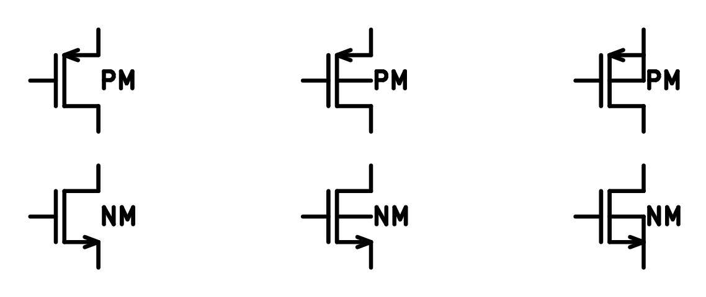
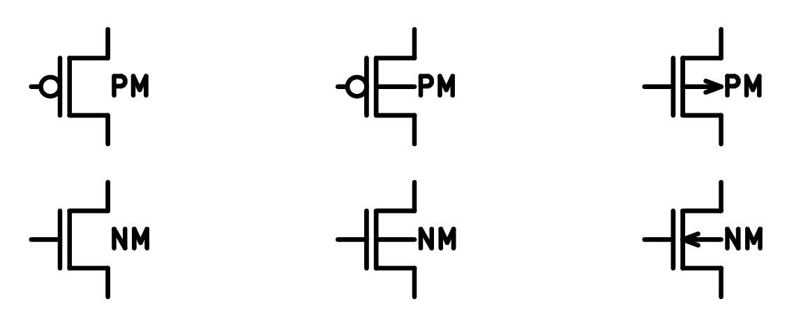
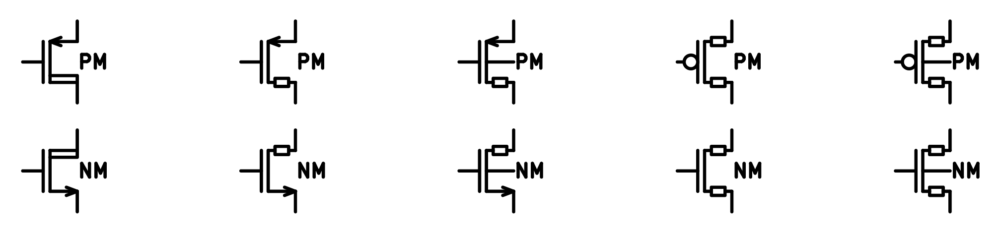
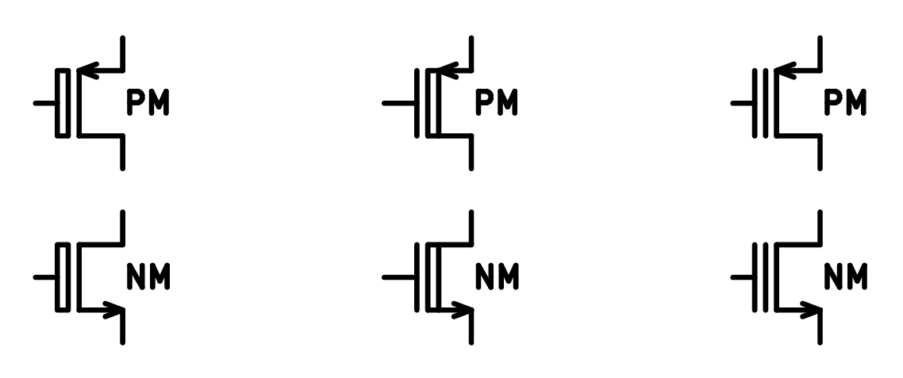
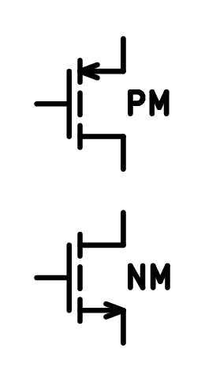
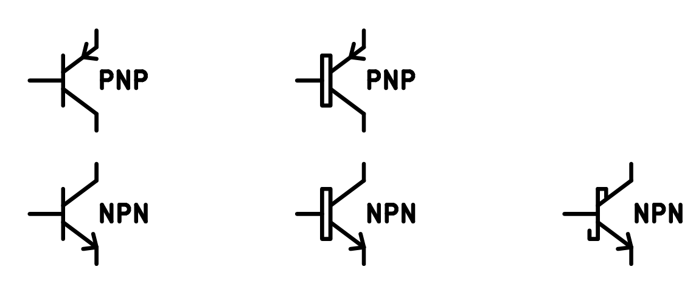
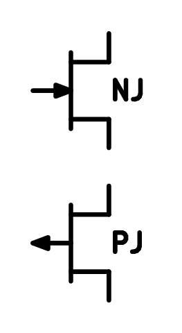

# KiCad Virtuoso-Style Symbol Library

KiCad 符号库 "0CMOS"，帮助您在 KiCad 环境中绘制 Virtuoso 风格的高质量原理图，用于论文和演示。

A complete KiCad symbol library named "0CMOS", with full transistor sets and analog functional blocks, built for creating Cadence Virtuoso-like schematics for theses, papers and technical presentations.

## Overview

从 Virtuoso 环境中截图得到的原理图的质量较差，不能直接用于论文或演示。用 Visio 或 Draw.io 等工具则需要调用质量未知的祖传库，随后还要微调样式、手动在导线交点上打点，移动符号后又要逐个修改连线。而 KiCad 本身就是 EDA 工具，在导入本符号库后可为您省却上述所有麻烦。

Drawing circuit diagrams with Visio or Draw.io requires manually adding wire junctions and reattaching lines after moving components. As a native EDA tool, KiCad provides a much smoother schematic workflow, paired with this dedicated symbol library.

Key Features:
 
- Comprehensive transistor symbols & common analog functional blocks
- Full EDA schematic drawing experience provided by KiCAD
- Export schematics to PDF / SVG vector graphics
 
## Library Scope:

为了保持库的简洁，无源器件如 RLC 请调用内置 Device 库中的器件，电源符号则在 Power 库中。本库主要内容为晶体管，以及 OTA、逻辑门。下面为您展示了库中主要的晶体管器件。

This library does not contain passive components (resistors, capacitors, inductors) and standard power symbols.

- Passive devices: Use KiCad's built-in "Device" library
- Power symbols: Use KiCad's built-in "Power" library

Transistor symbols include:

- Standard CMOS

	CMOS for general purpose, with or without explicit back-gate ("B" terminal) connection.

	

- Logic CMOS

	CMOS with alternative styles, with or without explicit back-gate connection.

	

- High-Voltage CMOS

	High-voltage device, DE-MOS or LD-MOS. Asymmetrical or symmetrical, with or without back-gate connection.

	

- MISC CMOS

	HV gate (thick gate oxide), alternative threshold (LVT/DVT/HVT), float gate (as in EPROM), along with enhancement-mode CMOS.

	

	

- Bipolars and JFETs
	
	Bipolar devices include standard and alternative style (for super-beta or high-gain devices). Additionally, schottky-base NPN.

	

	

Apart from transistors, the library provides gate-level symbols and functional blocks, include:

- OPA

	Single-end or diff

- OTA

- Logics

	(N)AND, (N)OR, BUF INV, X(N)OR, Flip-flop, Latch

- Sources

	idc, vdc, with or without trim arrow

- Misc Functional
	
	Switch, transmission gate, MUX, chopper

	ADC / DAC

	Pad / Pin

	Blocks representing SUM, OSC, Ramp, OneShot, ...

## Usage

建议将本库导入到 KiCad 全局，随后即可在库列表的顶端找到 0CMOS 及其所包含的器件。

KiCad 对层级原理图的支持较弱，建议您在单个原理图层级绘制所有需要的子图，或是为每一幅图建立一个原理图文件。随后根据需要，截图或导出到 PDF 或 SVG；PDF 可被直接插入 LaTeX 工作流，SVG 则可由 Inkscape 做精修（如需要）后导入到 Visio / Draw.io 环境、做最终的美化设计。

在绘制原理图阶段，作者给您的建议：1，使用 50mil（或 100mil）网格间距，使器件引脚刚好吸附在格点上；2，手动将器件 Value、导线 Label 等的字体修改为 Arial 或 Times New Roman，避免使用 KiCad 默认字体；3，导出到 SVG 时，根据图幅大小和缩放比例调整默认线宽，使得最终的电路图与正文、标注等元素保持一致。

Import the library to global:

1. Create or open a KiCad project
2. Launch Symbol Editor
3. File - Add library - Add to Global - Select downloaded "0CMOS.kicad_sym"
4. Save. The name "0CMOS" should let the library stay at the top of library list.

Typical Workflow
 
1. Design Virtuoso-style schematics in KiCad using this library, along with KiCad native "Device" and "Power" libraries
2. Export your schematic as PDF or SVG. For SVG, you can specify line stroke for better effect.
3. Import the vector file into Visio / Draw.io
4. Add custom decorations and styling for final theses or presentations

## License

仅限个人和学术使用，欢迎提出修改意见。

This project is licensed under the Creative Commons Attribution-NonCommercial 4.0 International License (CC BY-NC 4.0).

- Allowed: Personal & academic use, non-commercial modification and distribution. Attribution to the original author is required.
- Prohibited: Any form of commercial use, resale or commercial integration by third parties.
- The original author retains exclusive rights for all commercial usage of this library.
 
View full license details: https://creativecommons.org/licenses/by-nc/4.0/
